# System Architecture

## Current Synchronous Firmware

```mermaid
flowchart LR
    Host["PC UART terminal"] -->|"commands"| Console["command_console"]
    Console -->|"validated requests"| Controller["motor_controller"]
    Controller -->|"safe driver operations"| Driver["motor_driver"]
    Driver -->|"PWM1, PWM2, EN, ENB"| Bridge["TB9051FTG H-bridge"]
    Bridge --> Motor["12 V DC gearmotor"]
    Bridge -->|"DIAG"| Driver
    Controller -->|"state and fault telemetry"| Console
    Console -->|"UART responses"| Host
```

The modules have deliberately narrow responsibilities:

- `motor_driver` owns STM32 timers, GPIO, duty conversion, direction routing,
  and physical H-bridge control.
- `motor_controller` owns legal transitions, coast/brake policy, direction
  interlocks, fault latching, and safe shutdown.
- `command_console` owns interrupt-driven UART buffering, parsing, validation,
  and response formatting. It does not call the low-level driver.
- `main` initializes the modules and repeatedly processes controller safety
  monitoring and completed commands.

## State and Output Model

| State | Driver | PWM | Physical behavior |
|---|---|---|---|
| `UNINITIALIZED` | Not available | Zero | Startup only |
| `DISABLED` | Disabled | Zero | Coast, unarmed |
| `READY` | Disabled | Zero | Coast, armed |
| `RUNNING` | Enabled | One directional channel | Drive/brake PWM |
| `BRAKING` | Enabled | Both inputs low | Deliberate short brake |
| `FAULT` | Disabled | Zero | Coast with latched fault |

When READY receives nonzero duty, the controller first requests zero duty,
enables the driver, checks DIAG, and only then applies nonzero PWM. A zero-duty
command from RUNNING disables the driver and returns to READY/coast.

## Test Boundary

`motor_controller` depends on a HAL-free runtime driver interface. Native tests
link the production controller against a fake implementation, while STM32
firmware links it against `motor_driver.c`. This verifies policy independently
of registers and hardware.

## Planned Evolution

After safe hardware bring-up, encoder and current acquisition will feed the same
controller. The validated synchronous behavior will then be migrated to
FreeRTOS tasks, with UART and future CAN commands sharing one safety API.
